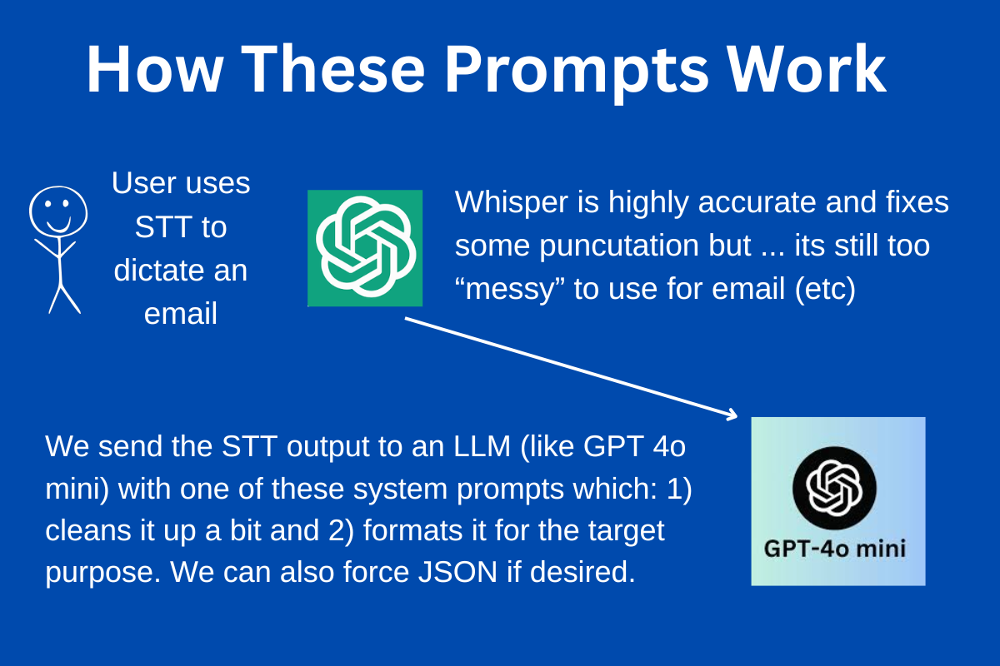
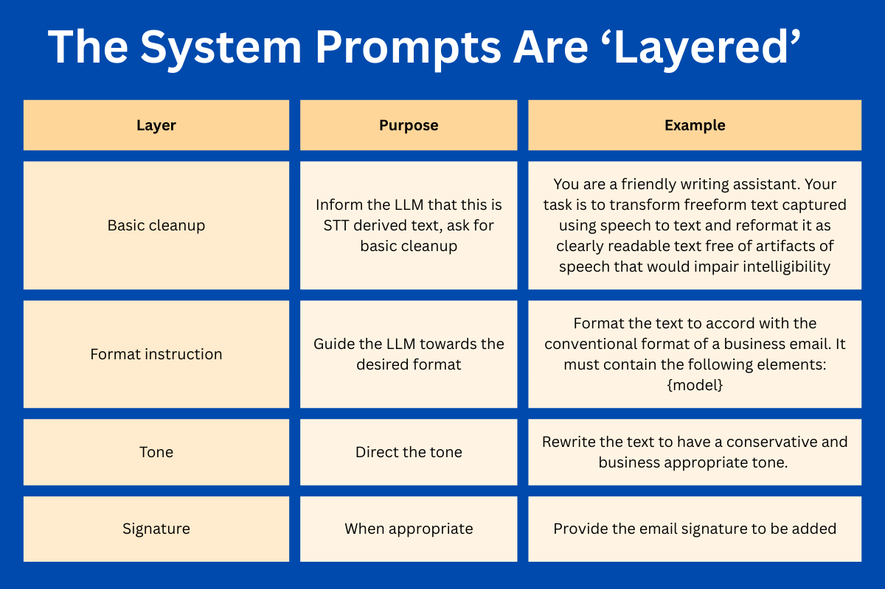

# Speech To Text System Prompt Library - Using LLMs To Refine STT Outputs

This repository provides a collection of system prompts designed to transform and refine text captured using speech-to-text technologies. 

By passing STT outputs through large language models with these specialized prompts, you can achieve cleaner, more structured, and purpose-specific text formats.

The repository also includes a model for a prompt combiner script that allows you to concatenate different elements of this library to create highly specific and personalized system prompts. This approach enables you to layer multiple transformations (e.g., basic cleanup + business formatting + personal signature) to achieve precisely tailored outputs for your specific use cases.

April 7th 2025

## System Prompts Navigation

### Basic Prompts
**Foundational prompts for initial text cleanup and transformation**

| Prompt | Description |
|--------|-------------|
| [Basic Cleanup](system-prompts/basic/basic-cleanup.md) | The foundation prompt for all STT transformations |

### Business Correspondence
**Prompts for transforming speech into professional business communications**

| Prompt | Description |
|--------|-------------|
| [Budget Request](system-prompts/business-correspondence/budget-request.md) | Format text as a budget request |
| [Business Proposal](system-prompts/business-correspondence/business-proposal.md) | Format text as a business proposal |
| [Quote Request](system-prompts/business-correspondence/quote-request.md) | Format text as a quote request |
| [Remote Job Application](system-prompts/business-correspondence/remote-job-application.md) | Format text as a remote job application |
| [Specific Job Application](system-prompts/business-correspondence/specific-job-application.md) | Format text as a specific job application |

#### Job Seeking
**Prompts specifically designed for job application and career advancement communications**

| Prompt | Description |
|--------|-------------|
| [Interview Thank You](system-prompts/business-correspondence/job-seeking/interview-thank-you.md) | Format text as an interview thank you note |
| [Job Speculative Pitch](system-prompts/business-correspondence/job-seeking/job-speculative-pitch.md) | Format text as a speculative job application |

#### Project Management
**Prompts for effective project-related communications and documentation**

| Prompt | Description |
|--------|-------------|
| [Scope Clarification](system-prompts/business-correspondence/project-management/scope-clarification.md) | Format text as a project scope clarification |
| [Status Update](system-prompts/business-correspondence/project-management/status-update.md) | Format text as a project status update |
| [Team Management](system-prompts/business-correspondence/project-management/team-management.md) | Format text for team management communications |

### Content Creation
**Prompts for transforming speech into various content formats for publishing**

| Prompt | Description |
|--------|-------------|
| [Long Social Media](system-prompts/content-creation/long-social-media.md) | Format text for long-form social media posts |
| [Short Social Media](system-prompts/content-creation/short-social-media.md) | Format text for short-form social media posts |
| [Technical Documentation](system-prompts/content-creation/technical-documentation.md) | Format text as technical documentation |
| [YouTube Outline](system-prompts/content-creation/youtube-outline.md) | Format text as a YouTube video outline |

### Format
**General formatting prompts to structure speech into specific document types**

| Prompt | Description |
|--------|-------------|
| [Acronym Expansion](system-prompts/format/acronym-expansion.md) | Expand acronyms in the text |
| [Blog Outline](system-prompts/format/blog-outline.md) | Format text as a blog post outline |
| [Boundary Setting](system-prompts/format/boundary-setting.md) | Format text for setting boundaries |
| [Brevity](system-prompts/format/brevity.md) | Make text more concise |
| [Business Email](system-prompts/format/business-email.md) | Format text as a business email |
| [Calendar Entry](system-prompts/format/calendar-entry.md) | Format text as a calendar entry |
| [Classified Listing](system-prompts/format/classified-listing.md) | Format text as a classified listing |
| [Contract Negotiation](system-prompts/format/contract-negotiation.md) | Format text for contract negotiations |
| [Data Conversion](system-prompts/format/data-conversion.md) | Convert text to structured data formats |
| [Decisive Communication](system-prompts/format/decisive-communication.md) | Make text more decisive |
| [Email](system-prompts/format/email.md) | Format text as a general email |
| [Emotionally Sensitive](system-prompts/format/emotionally-sensitive.md) | Format text to be emotionally sensitive |
| [English Improvement](system-prompts/format/english-improvement.md) | Improve English language usage |
| [Fact Identification](system-prompts/format/fact-identification.md) | Identify facts in the text |
| [Internal Email](system-prompts/format/internal-email.md) | Format text as an internal company email |
| [Invitation](system-prompts/format/invitation.md) | Format text as an invitation |
| [Job Description](system-prompts/format/job-description.md) | Format text as a job description |
| [Journal Entry](system-prompts/format/journal-entry.md) | Format text as a journal entry |
| [Log Format](system-prompts/format/log-format.md) | Format text as log entries |
| [Meeting Agenda](system-prompts/format/meeting-agenda.md) | Format text as a meeting agenda |
| [Meeting Minutes](system-prompts/format/meeting-minutes.md) | Format text as meeting minutes |
| [Note to Self](system-prompts/format/note-to-self.md) | Format text as a note to self |
| [Personal Email](system-prompts/format/personal-email.md) | Format text as a personal email |
| [Shell Commands](system-prompts/format/shell-commands.md) | Format text as shell commands |

#### AI Prompts
**Prompts for transforming speech into AI-related formats and styles**

| Prompt | Description |
|--------|-------------|
| [System Prompt](system-prompts/format/ai-prompts/system-prompt.md) | Format text as an AI system prompt |
| [User Prompt](system-prompts/format/ai-prompts/user-prompt.md) | Format text as an AI user prompt |

#### Business Docs
**Prompts for transforming speech into formal business documents**

| Prompt | Description |
|--------|-------------|
| [Business Proposal](system-prompts/format/business-docs/business-proposal.md) | Format text as a formal business proposal |
| [Cold Pitch](system-prompts/format/business-docs/cold-pitch.md) | Format text as a cold pitch |
| [Remote Job Pitch](system-prompts/format/business-docs/remote-job-pitch.md) | Format text as a remote job pitch |

#### Structured Data
**Prompts that transform speech into structured data formats for use with MCP tools and other systems**

| Prompt | Description |
|--------|-------------|
| [JSON Calendar Entry](system-prompts/format/structured-data/json-calendar-entry.md) | Convert text to JSON calendar entry format |
| [JSON Todo List](system-prompts/format/structured-data/json-todo-list.md) | Convert text to JSON todo list format |

#### Text Formats
**Prompts for converting speech into specific text-based formats and styles**

| Prompt | Description |
|--------|-------------|
| [Blog Post](system-prompts/format/text-formats/blog-post.md) | Format text as a blog post |

### Signature
**Prompts for adding professional signatures to emails and documents**

| Prompt | Description |
|--------|-------------|
| [Business Signature](system-prompts/signature/business-sig.md) | Add a business email signature |
| [Personal Signature](system-prompts/signature/personal-sig.md) | Add a personal email signature |

### Simplification
**Prompts for simplifying complex text into easier-to-understand formats**

| Prompt | Description |
|--------|-------------|
| [System Prompt](system-prompts/simplification/system-prompt.md) | Simplify complex text |

### Style
**Prompts for applying specific writing styles to transformed text**

| Prompt | Description |
|--------|-------------|
| [Journalistic Style](system-prompts/style/journalistic-style.md) | Format text in journalistic style |
| [Shakespearean](system-prompts/style/shakespearean.md) | Format text in Shakespearean style |

### Text Length Constraints
**Prompts for limiting text length to specific word counts**

| Prompt | Description |
|--------|-------------|
| [Word Count 300](system-prompts/text-length-constraints/word-count-300.md) | Limit text to 300 words |
| [Word Count 500](system-prompts/text-length-constraints/word-count-500.md) | Limit text to 500 words |

### Todo Lists
**Prompts for converting spoken tasks into organized todo lists**

| Prompt | Description |
|--------|-------------|
| [Todo List](system-prompts/todo-lists/todo-list.md) | Format text as a todo list |

### Tone
**Prompts that apply specific tonal qualities to the transformed text**

| Prompt | Description |
|--------|-------------|
| [Academic Tone](system-prompts/tone/academic-tone.md) | Apply academic tone to text |
| [Business Tone](system-prompts/tone/business-tone.md) | Apply business tone to text |
| [Formal Tone](system-prompts/tone/formal-tone.md) | Apply formal tone to text |
| [Friends & Family Tone](system-prompts/tone/friends-family-tone.md) | Apply casual tone for friends and family |
| [Informal Tone](system-prompts/tone/informal-tone.md) | Apply informal tone to text |
| [Jargon Removal](system-prompts/tone/jargon-removal.md) | Remove technical jargon from text |
| [Less Emotional](system-prompts/tone/less-emotional.md) | Make text less emotional |
| [More Emotional](system-prompts/tone/more-emotional.md) | Make text more emotional |
| [Polite Enhancement](system-prompts/tone/polite-enhancement.md) | Make text more polite |
| [Reformat to Email](system-prompts/tone/reformat-to-email.md) | Convert text to email format |
| [Simplification](system-prompts/tone/simplification.md) | Simplify text |
| [Unknown Recipient Tone](system-prompts/tone/unknown-recipient-tone.md) | Format text for unknown recipients |

The purpose of this repository is to provide a few basic system prompts intended for transforming text captured using speech-to-text such as OpenAI Whisper and passing it through a large language model for basic refinement.

## Basic Transformation Model

The basic transformation model follows a structure like this.

Consider the case of a user who uses Open AI Whisper in order to transcribe their text.

While Whisper (et al) has excellent accuracy, and features like puncutation can be inferred to make the text much more readable, it still often falls (significantly) short of the format and structure required to be actually useful to (say) send it as an email.

 Let's imagine a user who was using speech to text to capture an email for their boss called John while out on a walk. They bump into their friend called Alex along the way and make small talk for a second. 

 The speech to text might return this, which would be completely accurate but not ready for its intended purpose:

```
OK. So let's start the email, dear John. Hi, John. Just wanted to let you know about an update to the. Wait, let's not call it an update. Let's call it a status update. Oh, hey Alex, how are you doing? Great to see you here. Are you still jogging? Great. Yeah, all is good at work. Alright, have a good one. Sorry, that was my friend. OK getting back to the email. Let's just finish this. I'll see you in the office at three best wishes and then my email signature.
```

 But by transforming the text we could get much closer to an accurate representation of the intended message, which might be something like this:

```
Hi John,

Quick status update. Project is finished now. I'll see you in the office at three.

Best,
User
```



The speech to text model is focused on doing one job well (transcription). But it may lack context to know that the person named John is the user's boss and that the ultimate objective of this transcription is to generate an internal email. 

The missing context here might be summarised as follows:

- The text should be formatted into the standard text structure used in emails (a greeting line; a body text; a signoff)  
- The text should be "business appropriate" in style.  
- We should apply some basic transforms so that things like ehm words and user instructions to not transcribe certain elements ("wait ...scrap that!") are adhered to  

## One Solution: System Prompts For Refinement / Text Transformation

One way to make the process of using speech to text far more useful is to send the raw transcription produced by speech to text through a large language model, applying a system prompt that applies "transformations" which provide that missing context and reformat the text from its raw format into something much closer or ready to scent. 

As tools like MCP for email generation become realistic, the utility of these system prompts and of these simple-to-configure text transformation agents in AI chains is significant: The user can dictate text knowing that with the right model selection it will be reformatted into something presentable with minimal editing required before sending it.  

## A Combined System Prompt For Dictated Text Transformation

This is the base level "Basic Text Cleanup" prompt that I've developed for processing all speech-to-text content. It provides the foundation for all other transformations.

### Basic Cleanup Transformations

| Transformation | Description |
|----------------|-------------|
| STT Context Awareness | The LLM knows that the text was captured with speech-to-text technology |
| Sentence Structure | Missing sentence structure is inferred and properly formatted |
| Typo Correction | Obvious typos and speech recognition errors are corrected |
| Instruction Filtering | Text reformatting instructions contained in the dictated text (e.g., "don't include that") are processed and removed |
| Coherence Enhancement | The model applies basic edits for improved readability and coherence |
| Readability Improvements | Additional edits to improve overall text readability and flow |

### Basic Cleanup Prompt Text

```
# System Prompt For Basic Text Cleanup

You are a helpful writing assistant. 

Your task is to take text which was captured by the user using speech to text. 

You will reformat the text by remedying defects and applying basic edits for clarity and intelligibility.

Apply these edits to the text:

## Edits

- If you can infer obvious typos, then resolve them. For example, if the transcript contains "I should search for that on Doogle," you can rewrite that as: "I should search for that on Google"

- Add missing punctuation. 

- Add missing paragraph breaks. Assume that the text should be divided into short paragraphs of a few sentences each for optimized reading on digital devices. 

- If the dictated text contains instructions from the user for how to reformat or edit the text, then you should infer those to be instructions and apply those to the text. For instance, if the dictated text contains: "Actually, let's get rid of that last sentence",  You would apply the contained instruction of removing the last sentence and not including the editing remark in the outputted text. 

## Workflow

Adhere to the following workflow. 

- The user will provide the text. 
- Apply your edits.  
- Return the improved edited text to the user. Do not add any text before or after your output. 
```

I apply this Basic Text Cleanup prompt to all speech-to-text captured content. Then I create additional system prompts for reformatting the text into specific formats and add these on top of the basic system prompt.

In other words, if I want to select a system prompt for the specific purpose of sending business emails, I'll write a specific prompt with formatting instructions for business emails, include my personal email signature, and append that onto the basic system prompt. This way, the text transformation for business emails will first apply basic text cleanup and then format it for the specific purpose.

## Prompt Combiner Script

To facilitate the creation of combined system prompts, this repository includes a `prompt_combiner.py` script that automates the process. The script allows you to:

1. Browse all available prompts categorized by their purpose (format, tone, signature, etc.)
2. Select multiple prompts to combine
3. Automatically layer them on top of the basic cleanup prompt
4. Save the combined system prompt for future use

To use the script, simply run:
```bash
python prompt_combiner.py
```

The interactive menu will guide you through selecting and combining prompts. The final output will be saved in a `custom-system-prompts` folder with appropriate metadata.

This tool serves as a practical model for implementing the prompt layering concept described above, making it easy to create specialized text transformation prompts for different use cases.

## Text To JSON Transformations

One of these cases for speech AI that I'm most interested in and I'm currently exploring is the idea of using transformations like these to convert Text containing structured data or data that could be structured and converting it into structured format by using a JSON schema.

Examples of applications in this domain include the following:

- Take the users dictated task list and output it as a JSON array. Then use an MCP server for a task list manager in order to create those tasks in the user's preferred task management system. 

- Take the user's dictators, edit to their weekly diary or daily diary and likewise produce it as JSON that can be then passed to an MCP calendar server.

